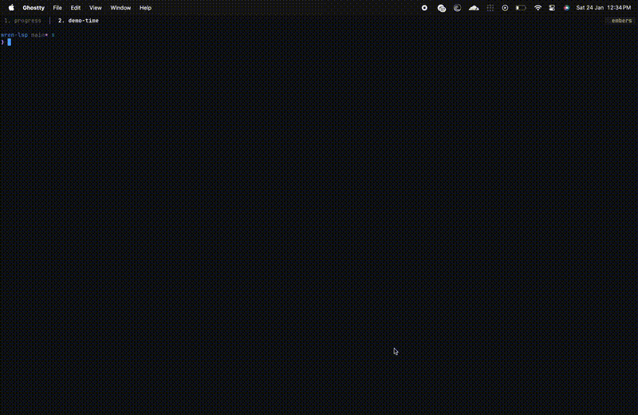

# LSP for Wren

LSP implementation for Wren.

## Features

- [x] Diagnostics (syntax + basic semantic checks)
- [x] Completion (identifiers, members, builtins, class methods)
- [x] Hover
- [x] Go to definition
- [x] References
- [x] Rename
- [x] Semantic tokens
- [x] Document symbols (outline)
- [x] Signature help
- [x] Document highlights
- [x] Code actions (quick fixes)
- [x] Workspace symbols
- [x] Folding ranges
- [x] Selection range
- [x] Inlay hints (type hints for variables)

## Demo



## Roadmap

- [ ] Call hierarchy
- [x] Configurable module resolution
- [ ] Cross-module navigation (multi-file)

## Releases

Download a binary based on your paltform from releases.

## Editor Setup

### Neovim

#### With lspconfig (recommended)

```lua
vim.filetype.add({
  extension = {
    wren = "wren",
  },
})

local lspconfig = require("lspconfig")
local configs = require("lspconfig.configs")

if not configs.wren_lsp then
  configs.wren_lsp = {
    default_config = {
      cmd = { "wren-lsp" },
      filetypes = { "wren" },
      root_dir = lspconfig.util.root_pattern("wren-lsp.json", ".git"),
    },
  }
end

lspconfig.wren_lsp.setup({})
```

#### Without lspconfig

```lua
vim.filetype.add({
  extension = {
    wren = "wren",
  },
})

vim.api.nvim_create_autocmd("FileType", {
  group = vim.api.nvim_create_augroup("wren", {}),
  pattern = "wren",
  callback = function()
    vim.lsp.start({
      name = "Wren LSP",
      cmd = { "wren-lsp" },
      root_dir = vim.loop.cwd(),
      flags = { exit_timeout = 1000 },
    })
  end,
})
```

### VS Code

Install from the [Visual Studio Marketplace](https://marketplace.visualstudio.com/items?itemName=jossephus.wren-lsp).

### Sublime Text

Install [LSP-wren-lsp](https://packagecontrol.io/packages/LSP-wren-lsp) from Package Control.

### Helix

Add this to `~/.config/helix/languages.toml`:

```toml
[language-server.wren-lsp]
command = "wren-lsp"

[[language]]
name = "wren"
scope = "text.wren"
file-types = ["wren"]
comment-token = "//"
language-servers = ["wren-lsp"]
```
